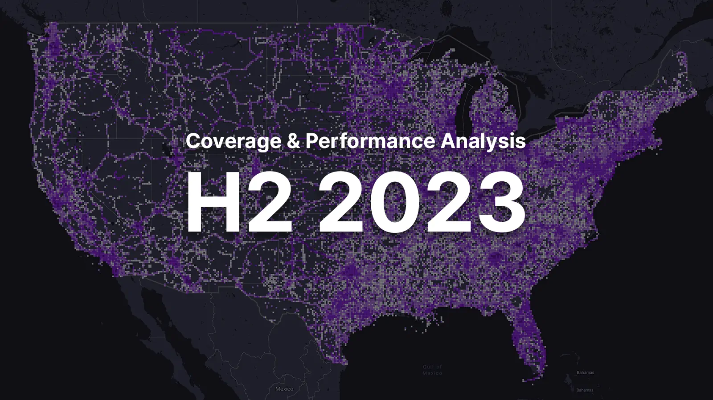
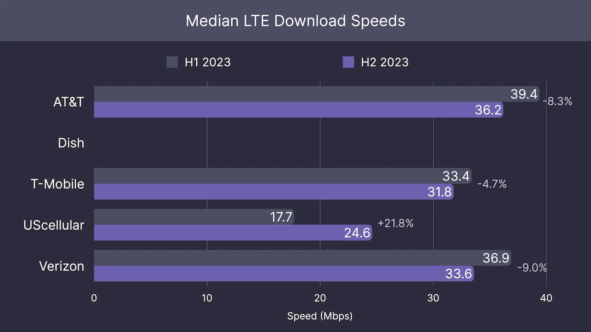
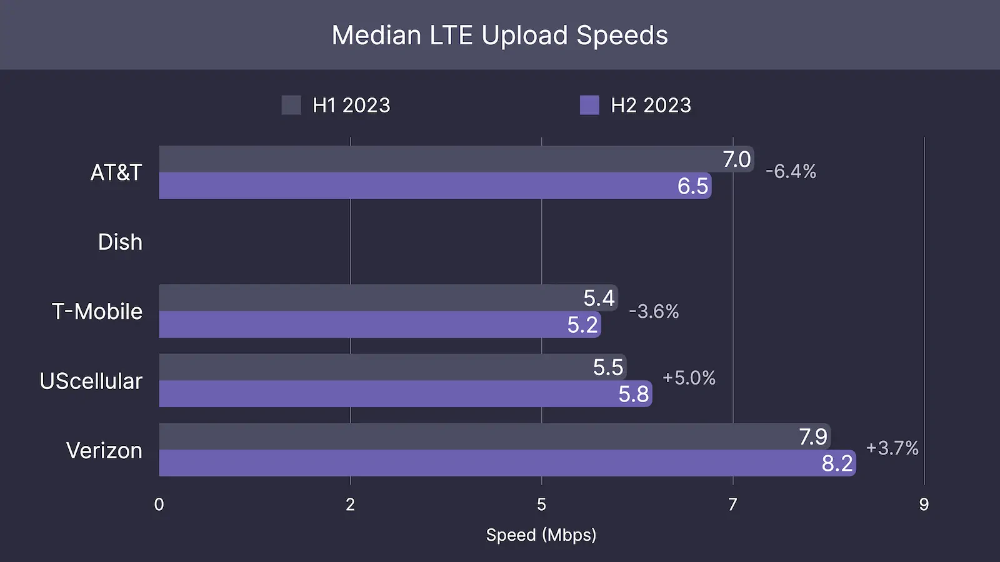
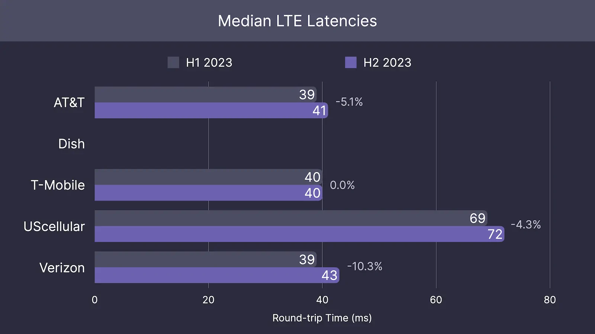
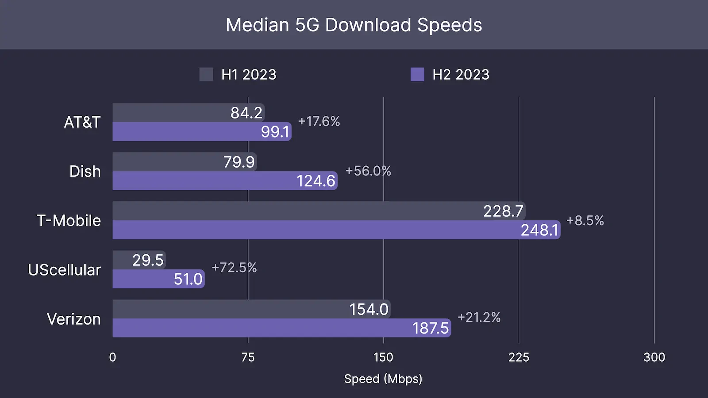
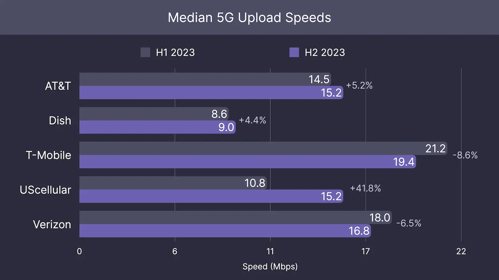
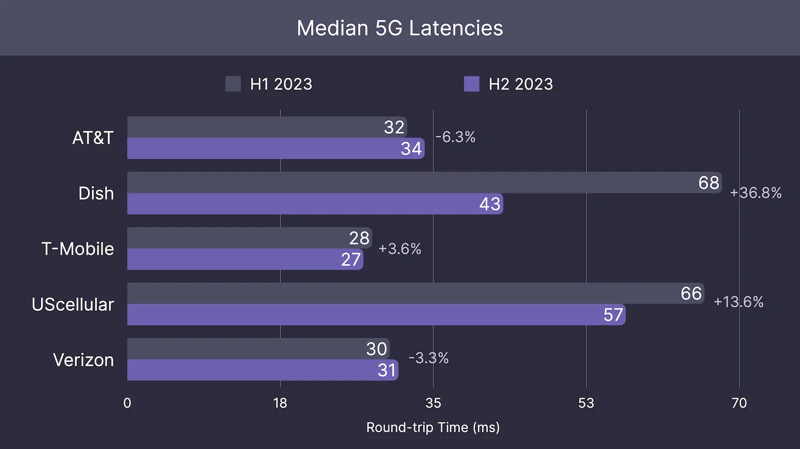

On May 21, 2024, the FCC released the latest batch of data for December 31st, 2023 as a part of the FCC's Broadband Data Collection program. With the release of this data, along with the crowdsourced Speed Test data we've collected, we can now paint a unique perspective of the US carriers for the second half of 2023. This report attempts to measure and analyze 2 important aspects of the 5 largest carriers -- coverage and performance.

### Summary
From June 2023 to December 2023, T-Mobile has seen the largest growth in LTE & 5G coverage of all the carriers with an over 1.6% increase. This is attributed mainly to their continued expansion into rural America. Verizon and AT&T have instead focused on investing heavily in upgrading their existing towers to incorporate 5G C-Band. Dish, on the other hand, has drastically slowed down their 5G expansion relative to previous years since they hit their June 2023 FCC coverage mandate.

When it comes to 5G performance, T-Mobile dominated the pack in all 5G performance categories, continuing the lead they've had for years. But this long-lasting lead is starting to diminish due to the accelerated growth of Verizon's C-Band network. Verizon's efforts lead to them having the largest median download speed improvements among the three primary carriers during this time period. AT&T also had significant performance improvements in both download and upload speeds, but they're still far behind Verizon and T-Mobile for overall 5G performance. Dish and UScellular continue the trend, seeing large 5G performance improvements, but still lagging behind in absolute performance relative to the 3 primary carriers.

On LTE, we measured speeds decreasing across the board for the 3 primary carriers, dropping by around 5% to 10%. This is likely caused by the continuing increase in the amount of devices connecting to these networks and their continually increasing bandwidth requirements. This underscores the necessity of 5G and its new spectrum for meeting future demand.
### Transparency
CoverageMap.com is an independent company whose mission is helping consumers make informed decisions about cellular coverage, performance, and reliability. We do not work on behalf of any carriers, are employed by any carriers, or receive any funding from them. Our decisions are made solely using speed test data we crowdsource and data provided by the FCC. CoverageMap's only relationship with the carriers is through referral programs, where we recommend and link cell phone plans if the carrier is a top performer in the area based on our public metrics.

### Methodology
This report relies on 2 different datasets, speed test and signal strength. Our speed test dataset is crowdsourced from users across the country and contains nearly 1.5 million results for 2023. The signal strength dataset comes from the FCC Broadband Data Collection. We utilize speed test data for measuring network performance and we use the FCC signal strength data for measuring network coverage.

##### Performance
To measure performance, we conduct speed tests on mobile devices nationwide. Leveraging crowdsourcing, our users perform these tests using publicly available speed testing applications and then upload their results to our system. These results include a range of metrics, such as device telemetry data and network performance benchmarks, aimed at measuring the maximum network throughput throughout the day. We define network performance as the median download speed, median upload speed, and median latency across the country.

We produce these medians by first aggregating all the speed tests run in similar locations into a single result. This is to account for scenarios when multiple tests are run in the exact same location. Accounting for this is important because we want to determine the median performance over all areas, not just popular areas or areas where users mostly frequent. We perform the first aggregation by taking the median result within each location. Once we have this aggregated location dataset, we then take the median again of the entire dataset, giving us our final median download speed, upload speed, and latency for each carrier and technology.

*\*We have also developed our own speed testing application, but it was released after 2023 and not relevant to this report.

##### Coverage
We use signal strength data for measuring coverage. The signal strength data comes from the FCC Broadband Data Collection. Every 6 months, internet service providers are required to submit data about their network performance and coverage to the FCC. This data is then published to the public with the goal of informing consumers where broadband service is available, and where it is not available. The published data contains cellular network metrics, including estimated signal strength data, which we use for determining coverage.

We utilize this data first by importing both the FCC Broadband Data Collection data for 06/30/2023 and for 12/31/2023. This data contains a set of h3-formatted hexagons for each carrier and technology; where each hexagon contains an estimated minimum signal strength in decibel-milliwatts, which measures the strength of a device's connection to a tower. The hexagons are roughly 0.12 miles in length with an area of around 0.03 square miles each.

We then run an internal correction and aggregation algorithm to attempt to normalize the data among all carriers. Since the data is calculated and submitted directly from the ISP's, each ISP calculates their coverage metrics differently, making it challenging to compare data between the carriers. Our internal algorithm works by grouping hexagons together to form larger hexagons (roughly 0.33 miles in length), averaging the estimated minimum signal strength, and comparing tower propagation characteristics to correct and normalize the signal strengths among the carriers. This algorithm is not perfect, but it helps fix potential inaccuracies in the data. Because of this, we do not publish total coverage footprints, just the change in coverage.

### Results
The below table lists the percentage change in coverage among each carrier between 06/30/2023 and 12/31/2023 in 49 US states (omitting Alaska) and including Washington D.C. We ignore Alaska due to its relatively large area and relatively low coverage footprint among all carriers. These values focus on areas of new coverage, not if a carrier is improving tower density by adding towers in already covered areas.

##### Percentage Change in Coverage
|               | LTE   | 5G          |
| ------------- | ----- | ----------- |
| AT&T          | 1.46% | Unavailable |
| Dish Wireless | N/A   | 0.98%       |
| T-Mobile      | 2.35% | 1.66%       |
| US Cellular   | 0.00% | 0.88%       |
| Verizon       | 0.00% | 0.70%       |

*Percentage change in coverage from 06/30/2023 to 12/31/2023 of the 49 US states (omitting Alaska) and Washington D.C.*

The tables below compare the median download speeds, upload speeds, and latencies by carrier and technology based on the first and second halves of the year. These values indicate how a network performs, including its speed and reliability. The first half of 2023 refers to tests run from January 1st, 2023 to June 30th, 2023, and the second half of 2023 refers to tests run from July 1st, 2023 to December 31st, 2023.

##### Median Download Speeds
|             | LTE     |         |        |     | 5G      |         |        |
| ----------- | ------- | ------- | ------ | --- | ------- | ------- | ------ |
|             | H1 2023 | H2 2023 | %      |     | H1 2023 | H2 2023 | %      |
| AT&T        | 39.4    | 36.2    | -8.3%  |     | 84.2    | 99.1    | +17.6% |
| Dish        |         |         |        |     | 79.9    | 124.6   | +56.0% |
| T-Mobile    | 33.4    | 31.8    | -4.7%  |     | 228.7   | 248.1   | +8.5%  |
| US Cellular | 17.7    | 24.6    | +21.8% |     | 29.5    | 51.0    | +72.5% |
| Verizon     | 36.9    | 33.6    | -9.0%  |     | 154.0   | 187.5   | +21.2% |

*Median download speeds (in megabits per second) during the first and second halves of 2023 by carrier and technology.*

##### Median Upload Speeds
|             | LTE     |         |       |     | 5G      |         |        |
| ----------- | ------- | ------- | ----- | --- | ------- | ------- | ------ |
|             | H1 2023 | H2 2023 | %     |     | H1 2023 | H2 2023 | %      |
| AT&T        | 7.0     | 6.5     | -6.4% |     | 14.5    | 15.2    | +5.2%  |
| Dish        |         |         |       |     | 8.6     | 9.0     | +4.4%  |
| T-Mobile    | 5.4     | 5.2     | -3.6% |     | 21.2    | 19.4    | -8.6%  |
| US Cellular | 5.5     | 5.8     | +5.0% |     | 10.8    | 15.2    | +41.8% |
| Verizon     | 7.9     | 8.2     | +3.7% |     | 18.0    | 16.8    | -6.5%  |

*Median upload speeds (in megabits per second) during the first and second halves of 2023 by carrier and technology.*

##### Median Latencies
|             | LTE     |         |        |     | 5G      |         |        |
| ----------- | ------- | ------- | ------ | --- | ------- | ------- | ------ |
|             | H1 2023 | H2 2023 | %      |     | H1 2023 | H2 2023 | %      |
| AT&T        | 39      | 41      | -5.1%  |     | 32      | 34      | -6.3%  |
| Dish        |         |         |        |     | 68      | 43      | +36.8% |
| T-Mobile    | 40      | 40      | +0.0%  |     | 28      | 27      | +3.8%  |
| US Cellular | 69      | 72      | -4.4%  |     | 66      | 57      | +13.6% |
| Verizon     | 39      | 43      | -10.3% |     | 30      | 31      | -3.3%  |

*Median latencies (in milliseconds) during the first and second halves of 2023 by carrier and technology.*

##### Total Number of Speed Tests
|             | LTE     |         |     | 5G      |         |
| ----------- | ------- | ------- | --- | ------- | ------- |
|             | H1 2023 | H2 2023 |     | H1 2023 | H2 2023 |
| AT&T        | 39,700  | 51,300  |     | 136,000 | 184,400 |
| Dish        |         |         |     | 4,600   | 13,400  |
| T-Mobile    | 30,400  | 31,100  |     | 187,900 | 230,100 |
| US Cellular | 4,800   | 880     |     | 2,400   | 1,400   |
| Verizon     | 99,400  | 128,100 |     | 131,700 | 217,900 |

*Total number of speed tests ran in the first and second halves of 2023 by carrier and technology.*

### Analysis

##### LTE - Coverage
For LTE, T-Mobile has made the most strides in increasing their coverage footprint, increasing it by 2.35%. AT&T is behind in second with a 1.46% percent increase. Verizon and UScellular have had no noticeable improvements in LTE coverage in the 6 months from June 2023 to December 2023. Dish is excluded here because they exclusively operate a 5G network.

T-Mobile's leading LTE coverage growth can be attributed to their strategy of expanding their reach into rural areas of the United States. Some of the largest areas of growth over these 6 months include West Virginia with a 8.1% increase, Illinois with a 8.1% increase, and Nebraska with an impressive 9.0% increase. T-Mobile has always been in a distant third when it came to rural coverage, so it's not surprising that they're trying to bridge the gap in the rural parts of the country. But even with these new expansions, T-Mobile still lags far behind Verizon and AT&T in overall rural coverage.

##### 5G - Coverage
With regard to 5G, the story is a bit more interesting. T-Mobile again made the most improvement in 5G, increasing their coverage by 1.66%. We estimate using the FCC data that T-Mobile has already upgraded around 90% of their towers to 5G. Since their 5G network upgrade is nearly complete, their 5G coverage can only grow if they expand to new locations. This is why we see leading coverage growth for T-Mobile in not just LTE coverage, but 5G as well -- they're expanding to new, more rural areas.

Verizon had a more modest growth on their 5G network, increasing by 0.88% -- but this doesn't tell the full story. Verizon's strategy over the past year has been clear; to focus on building out their mid-band Ultra Wideband network instead of their lower performing low-band network. Verizon's 3.7 GHz mid-band spectrum propagates shorter distances relative to the low-band frequencies (around a distance of 2 to 4 times shorter). As a result, even with a 0.88% increase, Verizon has upgraded more towers than what the number indicates. The latest FCC data also indicates that Verizon has been disabling 5G in some locations where they only operate low-band, contributing to a lower-than-expected 5G coverage growth. Some states saw pretty large decreases in 5G coverage, including Massachusetts which saw a 11.3% decrease in coverage, Delaware a 17.1% decrease, and Rhode Island with a whopping 18.4% decrease. Taking this into effect, Verizon likely had the largest mid-band growth among all the carriers in the second half of 2023.

For AT&T, we are unable to make a determination about their change in 5G coverage. This is because the latest batch of data they submitted to the FCC was malformed and as a result, we were unable to compare it with the previous data set. We managed to clean up some of this data and made it browsable on our interactive signal strength map, but it's not fixed to the point where we can accurately compare with the June 2023 dataset.

Dish saw an increase in their 5G network coverage by 0.98% from the end of June to December 2023. As a result of the T-Mobile/Sprint merger, Dish was required by the FCC to cover 70% of the US population with 5G coverage by June 14, 2023, which they claim to have hit. This means the 0.98% increase comes after they meet their FCC requirements. When we break down the 0.98% coverage increase by state, almost all of it comes from the New England area, with a massive 56.6% coverage increase in Rhode Island and 24.6% increase in Massachusetts. Other states saw very modest improvements, with most having less than a 1.0% increase in coverage in the 6-month period. It's clear that once Dish met their June 2023 requirement, their impressive month-to-month coverage growth that occurred over the past 2 years has slowed down drastically.

##### LTE - Performance

In the second half of 2023, LTE performance dropped for all three primary carriers (except for Verizon's upload speed, which had a slight increase). All three carriers saw a 5% to 10% decline in performance compared to the first half of 2023. This is a trend that has been observed consistently in the United States as more and more devices are added to the networks each year, with per-device usage continually increasing.

According to the CTIA, the United States sees about 30 million new wireless connections added annually. That's around a 5% increase year over year. Ericsson reports that in 2023 alone, data usage per device increased by 6.8 gigabytes per month, rising from 19.1 GB used to 25.9 GB—a whopping 35% increase. This surge in usage causes network congestion, leading to poorer performance for all users. These trends underscore the necessity for 5G adoption and its new spectrum to meet future cellular demand.

Regarding performance results, AT&T leads with the fastest median LTE download speed at 36.2 Mbps, followed closely by Verizon at 33.6 Mbps, and T-Mobile at 31.8 Mbps. For upload speed, Verizon holds its lead with a median LTE upload speed of 8.2 Mbps, with AT&T in second at 6.5 Mbps, and T-Mobile in third at 5.2 Mbps. All 3 carriers see similar latency on their LTE networks, hovering around 40 to 43 milliseconds.

##### 5G - Performance

5G networks have seen significant performance enhancements across all carriers, reflecting the ongoing investment and focus on expanding 5G. The focus on mid-band 5G has had the largest impact on these performance improvements, offering a good balance between coverage and performance. As the carriers deploy more mid-band across the country, 5G performance will continue to grow.

T-Mobile continues to dominate with the highest median 5G download speeds of 248.1 Mbps. This is even while having the smallest percentage increase in speeds among the carriers. These results are not surprising. T-Mobile has the most mature 5G mid-band network, having launched their network a year and half before Verizon and AT&T, as well as having finished upgrading nearly all their towers. This network maturity gives T-Mobile the performance crown, but as a result comes with smaller year-over-year performance increases.

Verizon's 21.2% increase in median 5G download speeds, rising to 187.5 Mbps, reflects their impressive growth of building out their 5G C-Band network. AT&T also had impressive 5G performance improvements, with a 17.6% increase in download speeds, reaching 99.1 Mbps -- though they still lag far behind T-Mobile and Verizon in absolute terms. Verizon and AT&T have been very aggressive with their 5G mid-band rollouts, but they still have a long way to go before they get to the same level of mid-band coverage and maturity as T-Mobile. Verizon has managed to stay ahead of AT&T in C-Band coverage and performance largely because they received FCC approval to start deploying their C-Band network much earlier than AT&T and because Verizon also owns more 5G mid-band spectrum than AT&T. As a result, Verizon has more C-Band deployed with larger spectrum channels than AT&T, allowing them to hit higher speeds on average compared to AT&T.

Dish's 56.0% increase in 5G download speeds and 36.8% decrease in latency is particularly impressive, suggesting aggressive enhancement of their 5G network. Based on our coverage analysis, Dish has slowed down their focus on growing coverage and instead look to be improving their existing networks performance. Their impressive improvements now means they have surpassed AT&T for the second half of 2023 in 5G download speeds. But this doesn't tell the whole story. While we don't know exactly how many users are on Dish's network, we can assume it's less than one million based on public reporting. Comparing that to AT&T, which has over 240 million connected devices, shows how Dish doesn't have to deal with network congestion like AT&T. So while yes, Dish is currently out performing AT&T in download speeds at the moment, as AT&T expands their 5G mid-band network and as more devices get added to Dish's network, AT&T will likely surpass Dish in download speeds in the future.
